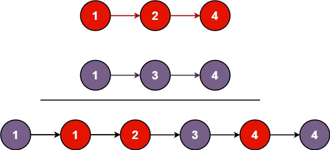

# 今日刷题

leetcode 简单题 #21 合并两个有序链表

> 将两个升序链表合并为一个新的 升序 链表并返回。新链表是通过拼接给定的两个链表的所有节点组成的。
> 
> 

遇到链表我真是一脸懵逼，完全不知道如何下手，还以为是数组，结果实际上跟数组不一样。

官方事先给了一个链表结构的js实现，我也是没看明白。

参考题解后，最终代码如下：

```js
/**
 * Definition for singly-linked list.
 * function ListNode(val, next) {
 *     this.val = (val===undefined ? 0 : val)
 *     this.next = (next===undefined ? null : next)
 * }
 */
/**
 * @param {ListNode} l1
 * @param {ListNode} l2
 * @return {ListNode}
 */
var mergeTwoLists = function(l1, l2) {
    if (!l1 || !l2) { return l1 || l2 }
    if (l1.val < l2.val) {
        l1.next = mergeTwoLists(l1.next, l2)
        return l1
    } else {
        l2.next = mergeTwoLists(l1, l2.next)
        return l2
    }
};
```

可是依然不理解。