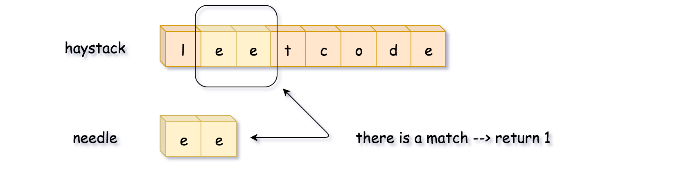

# 今日刷题

leetcode 简单题 #28 实现strStr()

>实现 strStr() 函数。
>
>给你两个字符串 haystack 和 needle ，请你在 haystack 字符串中找出 needle 字符串出现的第一个位置（下标从 0 开始）。如果不存在，则返回  -1 。
>
>说明：
>
>当 needle 是空字符串时，我们应当返回什么值呢？这是一个在面试中很好的问题。
>
>对于本题而言，当 needle 是空字符串时我们应当返回 0 。这与 C 语言的 str
>
>来源：力扣（LeetCode）
链接：https://leetcode-cn.com/problems/implement-strstr
著作权归领扣网络所有。商业转载请联系官方授权，非商业转载请注明出处。

看来是手写 js 的 indexOf 方法，要是一点也不用js 的api，还真不知道怎么写。

参考了官方题解的暴力破解法，拿到 needle 的长度，然后循环去 haystack 中截取并一一对比。



```js
/**
 * @param {string} haystack
 * @param {string} needle
 * @return {number}
 */
var strStr = function(haystack, needle) {
    if (needle === '') { return 0 }
    let result = -1
    const length2 = needle.length
    for (let i = 0; i < haystack.length; i++) {
        // 从haystack中截取needle长度的字符串来和needle做比较
        let newStr = haystack.substring(i, i + length2)  
        if (newStr === needle) {
            result = i
            break
        }
    }
    return result
};
```