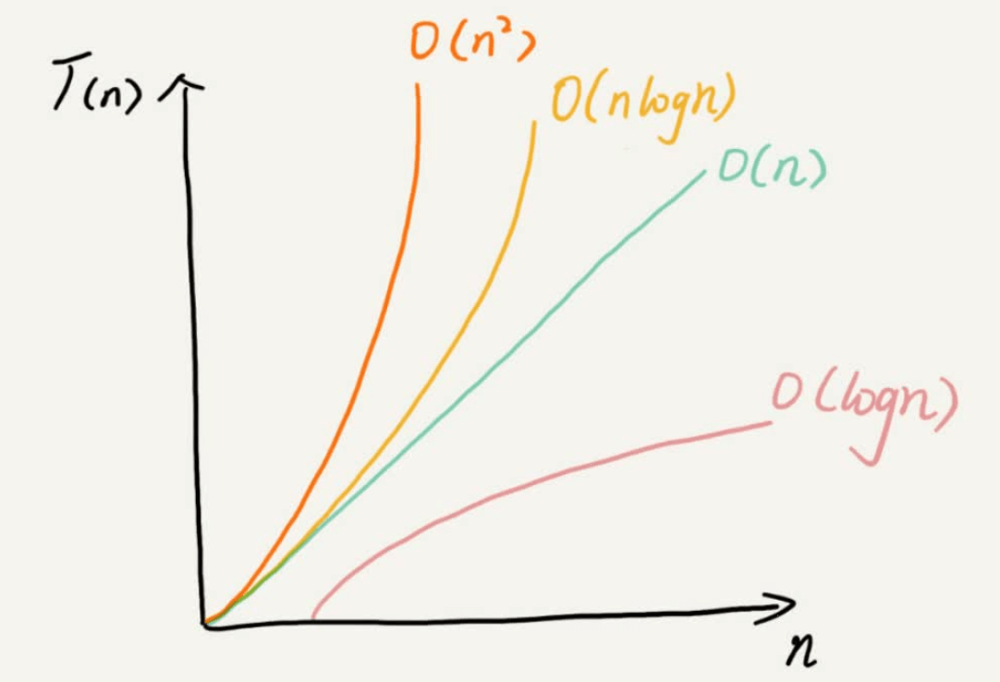

# 数据结构与算法之美 笔记

什么是数据结构？什么是算法？

从广义上讲，数据结构就是指一组数据的存储结构。
算法就是操作数据的一组方法。

从狭义上讲，是指某些著名的数据结构和算法，比如队列、栈、堆、二分查找、动态规划等。

## 划重点

10 个数据结构：数组、链表、栈、队列、散列表、二叉树、堆、跳表、图、Trie树；

10 个算法：递归、排序、二分查找、搜索、哈希算法、贪心算法、分治算法、回溯算法、动态规划、字符串匹配算法。

不要只是死记硬背，不要为了学习而学习，而是要学习它的“来历”、“自身的特点”、“适合解决的问题”以及“实际的应用场景”。

## 复杂度分析

复杂度也叫渐进复杂度，包括时间复杂度和空间复杂度，用来分析算法执行效率与数据规模之间的增长关系，可以粗略地表示，越高阶复杂度的算法，执行效率越低。

常见的复杂度并不多，从低阶到高阶有：O(1)、O(logn)、O(n)、O(nlogn)、O(n)。

也有最好、最坏、平均、均摊时间复杂度这些概念。

